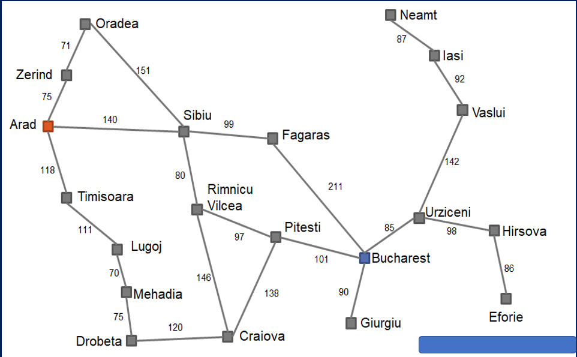
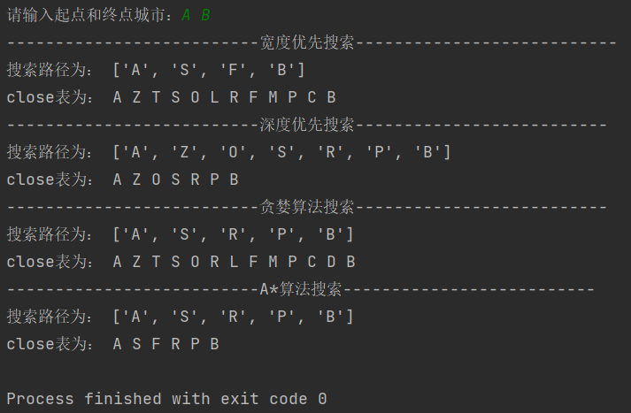
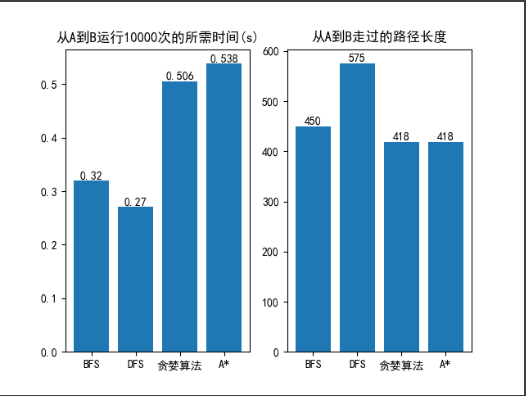
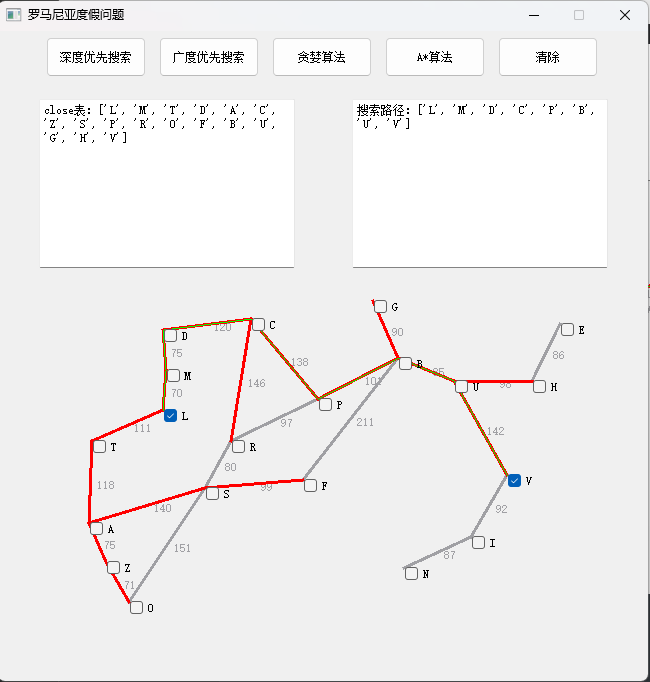

# 基于搜索算法解决罗马尼亚度假问题（代码版）

## 问题定义

本实验要求用**广度优先算法**、**深度优先算法**和**A*算法**求解“罗马尼亚度假问题”，即找到从初始地点 Arad 到目的地点 Bucharest 的一条最佳路径。



## 一些重要点

### 广度优先搜索

```python
def widthFirstSearch(self):
        startNode = Node()
        endNode = Node()
        for i in self.graph.nodes:
            if i.name == self.start:
                startNode = i
            if i.name == self.end:
                endNode = i
        close = []
        open = deque()
        open.append(startNode)
        while open:
            city = open.popleft()
            if city not in close:
                close.append(city)
                if city == endNode:
                    # print("宽度搜索路径为：")
                    # self.printPath(close)
                    # print("宽度搜索close表为：")
                    # for i in close:
                    #     print(i.name, end=" ")
                    self.close_width = close
                    self.open_width = open
                    return
                for i in city.next:
                    for j in self.graph.nodes:
                        if i[0] == j.name:
                            i = j
                            if i not in open and i not in close:  # 结点i既不在open表 又不在close表，代表它没有被访问过,
                                i.prev = city # 广度优先搜索只访问一次结点 
                                open.append(i)  # 只有没有被访问过的邻居，我们才将它加入open表中进行下一步操作
                                while i.prev:
                                    for j in i.next:
                                        if j[0] == i.prev.name:
                                            i.gn = j[1] + i.prev.gn
                                            i = i.prev
                                            break
                            break
```


### 深度优先搜索

只更新不在close表里的结点

```python
def deepFirstSearch(self):
        startNode = Node()
        endNode = Node()
        for i in self.graph.nodes:
            if i.name == self.start:
                startNode = i
            if i.name == self.end:
                endNode = i

        close = []
        open = []  # 模拟堆栈
        open.append(startNode)
        while open:
            city = open.pop()
            if city not in close:
                close.append(city)
                if city == endNode:
                    self.close_deepth = close
                    return
                for i in reversed(city.next): # 从小到大放入，因为cities表是从小到大
                    for j in self.graph.nodes:
                        if i[0] == j.name:
                            i = j
                            if i not in close:
                                i.prev = city
                                open.append(i)
                                while i.prev:
                                    for j in i.next:
                                        if j[0] == i.prev.name:
                                            i.gn = j[1] + i.prev.gn
                                            i = i.prev
                                            break
                            break

```


### 贪婪算法

从起点开始搜索每一个相邻城市，保存下前驱结点和走过的路径长度 **g(n)**, 如果走到重复结点，则判断 **g(n)**的大小进行前驱结点的更新。（类似**Dijkstra算法**）

```python
def greedSearch(self):
        startNode = Node()
        endNode = Node()
        for i in self.graph.nodes:
            if i.name == self.start:
                startNode = i
            if i.name == self.end:
                endNode = i
        close = []
        open = deque()
        open.append(startNode)
        while open:
            open = sorted(open, key=functools.cmp_to_key(self.compareValue))
            # open.sort(key=functools.cmp_to_key(self.compareValue))
            city = open.pop()
            if city not in close:
                close.append(city)
                if city == endNode:
                    # print("\n贪婪搜索路径为：")
                    # self.printPath(close)
                    # print("贪婪搜索close表为：")
                    # for i in close:
                    #     print(i.name, end=" ")
                    # print("\n搜索总代价为：", close[-1].gn)
                    self.close_greed = close
                    return
                for i in city.next:
                    for j in self.graph.nodes:
                        if i[0] == j.name:
                            cost = i[1]
                            i = j
                            if i not in open and i not in close:
                                i.prev = city  # 更新前置结点之前判断是否路径更佳，而不是简单的判断是否被访问
                                open.append(i)  # append是浅拷贝
                                while i.prev:
                                    for j in i.next:
                                        if j[0] == i.prev.name:
                                            i.gn = j[1] + i.prev.gn
                                            i = i.prev
                                            break
                            elif i.gn > (city.gn + cost):
                                i.prev = city  # 更新前置结点之前判断是否路径更佳，而不是简单的判断是否被访问
                                open.append(i)  # append是浅拷贝
                                while i.prev:
                                    for j in i.next:
                                        if j[0] == i.prev.name:
                                            i.gn = j[1] + i.prev.gn
                                            i = i.prev
                                            break
                            break
```


### A*算法

通过 $f(n) = g(n) + h(n)$ 这个函数来计算每个节点的**优先级**。

**其中**：

•f(n)是节点n的综合优先级。当我们选择下一个要遍历的节点时，我们总会选取综合优先级最高（值最小）的节点。

•g(n) 是节点n距离起点的代价。

•h(n)是节点n距离终点的预计代价，这也就是A*算法的启发函数。

```python


    def AstarAlgorithm(self):
        # 计算城市图每个点到终点城市的距离,获取h(n):节点n距离终点的预计代价,也就是A*算法的启发函数
        distance = {}
        startNode = Node()
        endNode = Node()
        for i in self.graph.nodes:
            distance[i.name] = math.sqrt(pow(i.point[0] - self.cities[self.end][0][0], 2) + \
                                         pow(i.point[1] - self.cities[self.end][0][1], 2))
            if i.name == self.start:
                startNode = i
            if i.name == self.end:
                endNode = i

        close = []
        open = deque()
        open.append(startNode)
        while open:
            # 对open表排序
            open = deque(sorted(open, key=functools.cmp_to_key(self.compareNode)))
            city = open.popleft()
            # city结点不在close里面则放入city表
            # city结点拥有最小的fn值
            if city not in close:
                close.append(city)
                if city == endNode:
                    # print("\nA*搜索close表为：")
                    # for i in close:
                    #     print(i.name, end=" ")
                    # print("\nA*搜索路径为：")
                    # self.printPath(close)
                    # print("\n搜索总代价为：", close[-1].gn)
                    self.close_Astar = close
                    return
                else:
                    for i in city.next:
                        for j in self.graph.nodes:
                            if i[0] == j.name:
                                cost = i[1]
                                i = j
                                if i not in open and i not in close:
                                    # 判断是否被访问
                                    i.prev = city
                                    # print(f"{i.name}<-{city.name}")
                                    open.append(i)
                                    # 计算当前结点到起点已经走过的代价并且加上欧式距离 获取f(n)=g(n)+h(n)
                                    # g(n):节点n距离起点的代价 这个代价是已知的，只需要把走过的路花费的代价加起来
                                    while i.prev:
                                        for j in i.next:
                                            if j[0] == i.prev.name:
                                                i.gn = j[1] + i.prev.gn
                                                i.fn = i.gn + distance[i.name]
                                                i = i.prev
                                                break
                                elif i.gn > (city.gn + cost):
                                    i.prev = city  # 更新前置结点之前还要判断是否路径更佳
                                    open.append(i)  # append是浅拷贝
                                    while i.prev:
                                        for j in i.next:
                                            if j[0] == i.prev.name:
                                                i.gn = j[1] + i.prev.gn
                                                i.fn = i.gn + distance[i.name]
                                                i = i.prev
                                                break
                                break

```


### 数据结构

 open表，close表，**数据字典** cities

```python
# cities是一个字典 第一个表示城市坐标，第二个list表示相邻城市及其路径权重
self.cities = {'A': [(91, 492), [['Z', 75], ['T', 118], ['S', 140]]],
               'B': [(400, 327), [['U', 85], ['G', 90], ['P', 101], ['F', 211]]],
               'C': [(253, 288), [['D', 120], ['P', 138], ['R', 146]]],
               'D': [(165, 299), [['M', 75], ['C', 120]]],
               'E': [(562, 293), [['H', 86]]],
               'F': [(305, 449), [['S', 99], ['B', 211]]],
               'G': [(375, 270), [['B', 90]]],
               'H': [(534, 350), [['E', 86], ['U', 98]]],
               'I': [(473, 506), [['N', 87], ['V', 92]]],
               'L': [(165, 379), [['M', 70], ['T', 111]]],
               'M': [(168, 339), [['L', 70], ['D', 75]]],
               'N': [(406, 537), [['I', 87]]],
               'O': [(131, 571), [['Z', 71], ['S', 151]]],
               'P': [(320, 368), [['R', 97], ['B', 101], ['C', 138]]],
               'R': [(233, 410), [['S', 80], ['P', 97], ['C', 146]]],
               'S': [(207, 457), [['R', 80], ['F', 99], ['A', 140], ['O', 151]]],
               'T': [(94, 410), [['L', 111], ['A', 118]]],
               'U': [(456, 350), [['B', 85], ['H', 98], ['V', 142]]],
               'V': [(509, 444), [['I', 92], ['U', 142]]],
               'Z': [(108, 531), [['O', 71], ['A', 75]]]}
```

简单的**结点类**和**图类**：

```python
class Node:
    def __init__(self):
        self.name = ''
        self.point = (0, 0)
        self.next = []
        self.prev = None
        self.fn = 0
        self.gn = 0
        class Graph:
def __init__(self):
	# 所有结点构成图
	self.nodes = []

```

## 搜索算法的完整实现

```python
# GraphSearch 这个类实现了各种搜索算法：DFS, BFS, GreedSearch, AStarSearch
class GraphSearch():
    def __init__(self, start='A', end='B'):
        self.start = start
        self.end = end
        # cities是一个字典 第一个表示城市坐标，第二个list表示相邻城市及其路径权重
        self.cities = {'A': [(91, 492), [['Z', 75], ['T', 118], ['S', 140]]],
                       'B': [(400, 327), [['U', 85], ['G', 90], ['P', 101], ['F', 211]]],
                       'C': [(253, 288), [['D', 120], ['P', 138], ['R', 146]]],
                       'D': [(165, 299), [['M', 75], ['C', 120]]],
                       'E': [(562, 293), [['H', 86]]],
                       'F': [(305, 449), [['S', 99], ['B', 211]]],
                       'G': [(375, 270), [['B', 90]]],
                       'H': [(534, 350), [['E', 86], ['U', 98]]],
                       'I': [(473, 506), [['N', 87], ['V', 92]]],
                       'L': [(165, 379), [['M', 70], ['T', 111]]],
                       'M': [(168, 339), [['L', 70], ['D', 75]]],
                       'N': [(406, 537), [['I', 87]]],
                       'O': [(131, 571), [['Z', 71], ['S', 151]]],
                       'P': [(320, 368), [['R', 97], ['B', 101], ['C', 138]]],
                       'R': [(233, 410), [['S', 80], ['P', 97], ['C', 146]]],
                       'S': [(207, 457), [['R', 80], ['F', 99], ['A', 140], ['O', 151]]],
                       'T': [(94, 410), [['L', 111], ['A', 118]]],
                       'U': [(456, 350), [['B', 85], ['H', 98], ['V', 142]]],
                       'V': [(509, 444), [['I', 92], ['U', 142]]],
                       'Z': [(108, 531), [['O', 71], ['A', 75]]]}
        self.graph = Graph()
        self.close_width = 0
        self.open_width = 0
        self.close_deepth = 0
        self.close_greed = 0
        self.close_Astar = 0

    def constructGraph(self):
        for i in self.cities:
            # print(i, self.cities[i])
            node = Node()
            node.name = i
            node.point = self.cities[i][0]
            node.next = self.cities[i][1]  # 包含了 邻居城市与它们之间的距离
            self.graph.nodes.append(node)

    def printPath(self, close):
        endNode = close[-1]
        path = [endNode.name]
        # 从终点向前找
        while path[-1] != self.start:
            if endNode.prev:
                path.append(endNode.prev.name)
                endNode = endNode.prev
        path.reverse()

        print("搜索路径为：", path)

        print("close表为：", end=" ")
        for i in close:
            print(i.name, end=" ")
        print()

    def widthFirstSearch(self):
        startNode = Node()
        endNode = Node()
        for i in self.graph.nodes:
            if i.name == self.start:
                startNode = i
            if i.name == self.end:
                endNode = i
        close = []
        open = deque()
        open.append(startNode)
        while open:
            city = open.popleft()
            if city not in close:
                close.append(city)
                if city == endNode:
                    # print("宽度搜索路径为：")
                    # self.printPath(close)
                    # print("宽度搜索close表为：")
                    # for i in close:
                    #     print(i.name, end=" ")
                    self.close_width = close
                    self.open_width = open
                    return
                for i in city.next:
                    for j in self.graph.nodes:
                        if i[0] == j.name:
                            i = j
                            if i not in open and i not in close:  # 结点i既不在open表 又不在close表，代表它没有被访问过,
                                i.prev = city
                                open.append(i)  # 只有没有被访问过的邻居，我们才将它加入open表中进行下一步操作
                                while i.prev:
                                    for j in i.next:
                                        if j[0] == i.prev.name:
                                            i.gn = j[1] + i.prev.gn
                                            i = i.prev
                                            break
                            break

    def deepFirstSearch(self):
        startNode = Node()
        endNode = Node()
        for i in self.graph.nodes:
            if i.name == self.start:
                startNode = i
            if i.name == self.end:
                endNode = i

        close = []
        open = []  # 模拟堆栈
        open.append(startNode)
        while open:
            city = open.pop()
            if city not in close:
                close.append(city)
                if city == endNode:
                    self.close_deepth = close
                    return
                for i in reversed(city.next):
                    for j in self.graph.nodes:
                        if i[0] == j.name:
                            i = j
                            if i not in close:
                                i.prev = city
                                open.append(i)
                                while i.prev:
                                    for j in i.next:
                                        if j[0] == i.prev.name:
                                            i.gn = j[1] + i.prev.gn
                                            i = i.prev
                                            break
                            break

    def greedSearch(self):
        startNode = Node()
        endNode = Node()
        for i in self.graph.nodes:
            if i.name == self.start:
                startNode = i
            if i.name == self.end:
                endNode = i
        close = []
        open = deque()
        open.append(startNode)
        while open:
            open = sorted(open, key=functools.cmp_to_key(self.compareValue))
            # open.sort(key=functools.cmp_to_key(self.compareValue))
            city = open.pop()
            if city not in close:
                close.append(city)
                if city == endNode:
                    # print("\n贪婪搜索路径为：")
                    # self.printPath(close)
                    # print("贪婪搜索close表为：")
                    # for i in close:
                    #     print(i.name, end=" ")
                    # print("\n搜索总代价为：", close[-1].gn)
                    self.close_greed = close
                    return
                for i in city.next:
                    for j in self.graph.nodes:
                        if i[0] == j.name:
                            cost = i[1]
                            i = j
                            if i not in open and i not in close:
                                i.prev = city  # 更新前置结点之前判断是否路径更佳，而不是简单的判断是否被访问
                                open.append(i)  # append是浅拷贝
                                while i.prev:
                                    for j in i.next:
                                        if j[0] == i.prev.name:
                                            i.gn = j[1] + i.prev.gn
                                            i = i.prev
                                            break
                            elif i.gn > (city.gn + cost):
                                i.prev = city  # 更新前置结点之前判断是否路径更佳，而不是简单的判断是否被访问
                                open.append(i)  # append是浅拷贝
                                while i.prev:
                                    for j in i.next:
                                        if j[0] == i.prev.name:
                                            i.gn = j[1] + i.prev.gn
                                            i = i.prev
                                            break
                            break

    def AstarAlgorithm(self):
        # 计算城市图每个点到终点城市的距离,获取h(n):节点n距离终点的预计代价,也就是A*算法的启发函数
        distance = {}
        startNode = Node()
        endNode = Node()
        for i in self.graph.nodes:
            distance[i.name] = math.sqrt(pow(i.point[0] - self.cities[self.end][0][0], 2) + \
                                         pow(i.point[1] - self.cities[self.end][0][1], 2))
            if i.name == self.start:
                startNode = i
            if i.name == self.end:
                endNode = i

        close = []
        open = deque()
        open.append(startNode)
        while open:
            # 对open表排序
            open = deque(sorted(open, key=functools.cmp_to_key(self.compareNode)))
            city = open.popleft()
            # city结点不在close里面则放入city表
            # city结点拥有最小的fn值
            if city not in close:
                close.append(city)
                if city == endNode:
                    # print("\nA*搜索close表为：")
                    # for i in close:
                    #     print(i.name, end=" ")
                    # print("\nA*搜索路径为：")
                    # self.printPath(close)
                    # print("\n搜索总代价为：", close[-1].gn)
                    self.close_Astar = close
                    return
                else:
                    for i in city.next:
                        for j in self.graph.nodes:
                            if i[0] == j.name:
                                cost = i[1]
                                i = j
                                if i not in open and i not in close:
                                    # 判断是否被访问
                                    i.prev = city
                                    # print(f"{i.name}<-{city.name}")
                                    open.append(i)
                                    # 计算当前结点到起点已经走过的代价并且加上欧式距离 获取f(n)=g(n)+h(n)
                                    # g(n):节点n距离起点的代价 这个代价是已知的，只需要把走过的路花费的代价加起来
                                    while i.prev:
                                        for j in i.next:
                                            if j[0] == i.prev.name:
                                                i.gn = j[1] + i.prev.gn
                                                i.fn = i.gn + distance[i.name]
                                                i = i.prev
                                                break
                                elif i.gn > (city.gn + cost):
                                    i.prev = city  # 更新前置结点之前判断是否路径更佳，而不是简单的判断是否被访问
                                    # print(f"{i.name}<-{city.name}")
                                    open.append(i)  # append是浅拷贝
                                    while i.prev:
                                        for j in i.next:
                                            if j[0] == i.prev.name:
                                                i.gn = j[1] + i.prev.gn
                                                i.fn = i.gn + distance[i.name]
                                                i = i.prev
                                                break
                                break

    def compareValue(self, node1, node2):
        # 小的排右边
        if node1.gn < node2.gn:
            return 1
        elif node1.gn > node2.gn:
            return -1
        else:
            return 0

    def compareNode(self, node1, node2):
        if node1.fn > node2.fn:
            return 1
        elif node1.fn < node2.fn:
            return -1
        else:
            # fn相等按gn算
            if node1.gn > node2.gn:
                return 1
            else:
                return -1
```

## 算法测试与结果对比

### 时间测试类

```python
import timeit
# 这个类用来进行算法的时间测试
class Test:
    def __init__(self, test_times=100000):
        # 默认测试100000次

        self.test_times = test_times
        self.t_wid = 0
        self.t_deep = 0
        self.t_greed = 0
        self.t_astar = 0

    def getTotalTime(self):
        self.t_wid = timeit.timeit(stmt='gs.widthFirstSearch()',
                                   setup='from __main__ import gs',
                                   number=self.test_times)

        self.t_deep = timeit.timeit(stmt='gs.deepFirstSearch()',
                                    setup='from __main__ import gs',
                                    number=self.test_times)

        self.t_greed = timeit.timeit(stmt='gs.greedSearch()',
                                     setup='from __main__ import gs',
                                     number=self.test_times)

        self.t_astar = timeit.timeit(stmt='gs.AstarAlgorithm()',
                                     setup='from __main__ import gs',
                                     number=self.test_times)        
```

### 主程序入口

```python
if __name__ == "__main__":
    # 主程序入口
    p = input("请输入起点和终点城市：").split()
    start = p[0]
    end = p[1]
    gs = GraphSearch(start, end)  # 第一个参数是起点城市名的首字母 第二个是终点城市名的首字母
    gs.constructGraph()  # 构建城市图

    # 空间维度测试
    len1 = []
    print("--------------------------宽度优先搜索---------------------------")
    gs.widthFirstSearch()
    gs.printPath(gs.close_width)
    a = gs.close_width[-1].gn
    len1.append(a)
    print("--------------------------深度优先搜索--------------------------")
    gs.deepFirstSearch()
    gs.printPath(gs.close_deepth)
    a = gs.close_deepth[-1].gn
    len1.append(a)
    print("--------------------------贪婪算法搜索--------------------------")
    gs.greedSearch()
    gs.printPath(gs.close_greed)
    a = gs.close_greed[-1].gn
    len1.append(a)
    print("--------------------------A*算法搜索--------------------------")
    gs.AstarAlgorithm()
    a = gs.close_greed[-1].gn
    len1.append(a)
    gs.printPath(gs.close_Astar)

    # 时间维度测试 基于上方定义的gs对象
    test = Test(test_times=10000)
    test.getTotalTime()

    # 画图
    plt.rcParams['font.sans-serif'] = ['SimHei']  # 使图形中的中文正常编码显示
    plt.rcParams['axes.unicode_minus'] = False  # 使坐标轴刻度表签正常显示正负号
    algorithm = ('BFS', 'DFS', '贪婪算法', 'A*')
    time1 = [test.t_wid, test.t_deep, test.t_greed, test.t_astar]
    plt.subplot(1, 2, 1)
    plt.bar(algorithm, time1)
    plt.title(f'从{start}到{end}运行{test.test_times}次的所需时间(s)')
    for a, b in zip(algorithm, time1):
        plt.text(a, round(b, 3), round(b, 3), ha='center', va='bottom')
    # 路径对比
    plt.subplot(1, 2, 2)
    plt.bar(algorithm, len1)
    for a, b in zip(algorithm, len1):
        plt.text(a, b, b, ha='center', va='bottom')
    plt.title(f"从{start}到{end}走过的路径长度")
    plt.show()

```

### 测试结果





如果你想使用GUI版本可以直接下载release里面的exe文件，打开就可以运行。或者你是开发者，把项目下载下来，直接运行 ui_widget.py 文件。

效果如下：

黄色代表搜索路径

红色代表close表走过的所有结点



